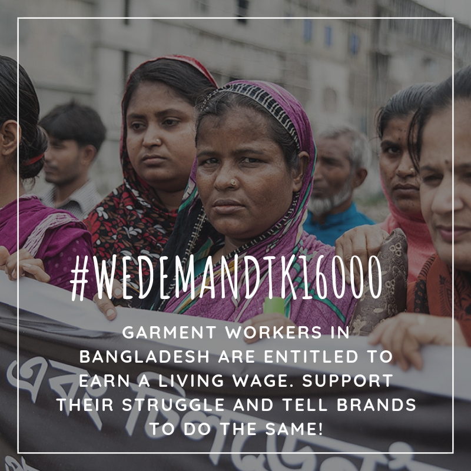

Today’s hunger strike in Bangladesh should serve as a stark reminder that the announced minimum wage of 8,000 taka will leave many workers and their families hungry and unable to cover other basic living cost. While H&M keeps referring to the requirement that their suppliers pay at least the national minimum wage and stressing the importance of workers participation in determining wage levels, it has still not publicly supported the Bangladeshi unions' minimum wage demand, just as it has not stayed true to the specific living wage commitment made in 2013.
<!-- end -->

As brands duck their responsibility to ensure human rights, including the right to a living wage, are respected across their supply chains, the struggle for a minimum wage in Bangladesh that would enable a decent life continues. The National Garment Workers Federation (NGWF), an IndustriALL global union affiliate, organized a hunger strike today to highlight the importance of meeting workers’ demands.

Workers have been publicly expressing their disagreement with the announced minimum wage and articulating their well justified demands despite a long history of repression and intimidation. This has galvanized international support for the workers' struggle.

Today, Clean Clothes Campaign members and partners around the world are issuing statements of solidarity with workers on hunger strike and others in Bangladesh who have united behind the demand for a 16,000 taka minimum wage (social media messages contain #WeDemandTk16000). The IndustriALL Bangladesh Council and other workers’ representatives have repeatedly clearly communicated this demand to the Minimum wage board, along with the demand for a statutory framework to govern pay grades and promotion and other welfare measures.

Following the government’s unilateral declaration of the 8,000 taka minimum wage – to be in effect as of December 2018 – it became apparent that workers would not only be deprived of a living wage but would suffer additional negative consequences because the share of the basic wage component in the total minimum wage has been decreased. That means workers would be forced to accept poverty wages as well as a lower basis for the calculation of overtime, severance pay and service and retirement benefits.

Clean Clothes Campaign supports the workers’ unions call for an immediate review of the announced amount so that the share of the basic wage is increased rather than reduced, and so that the new minimum wage is set at 16,000 taka, which is the minimum amount workers need to meet their families’ basic needs.

"This situation throws the spotlight on the hypocrisy of many major brands that source from Bangladesh. We have been contacting 25 of them over the past months. They all tell the consumers that they respect the right to a living wage, and they pay lip service to the importance of workers' voice in determining wage levels – yet they have failed to show the leadership we have been asking for in terms of supporting the workers. Nevertheless, we are once again renewing our call for other brands to join Inditex in publicly supporting the 16,000 taka minimum wage demand," said Ineke Zeldenrust of Clean Clothes Campaign.

H&M is the biggest buyer from Bangladesh. This massive retailer, reporting billions of euros of profits, is the focus of the "Turn Around, H&M!" campaign for its failure to stay true to the commitment that 850,000 garment workers making H&M clothes would be paid a living wage by this year. Many of those workers are based in Bangladesh, and a vast majority of them are women. Research has shown that poverty wages -- their current reality -- increase the risk of gender based violence, among many other negative repercussions.

Use your voice on social media to express solidarity with the workers in Bangladesh and say #WeDemandTk16000. Don’t forget to also include #TurnAroundHM to remind H&M of its living wage promise.

