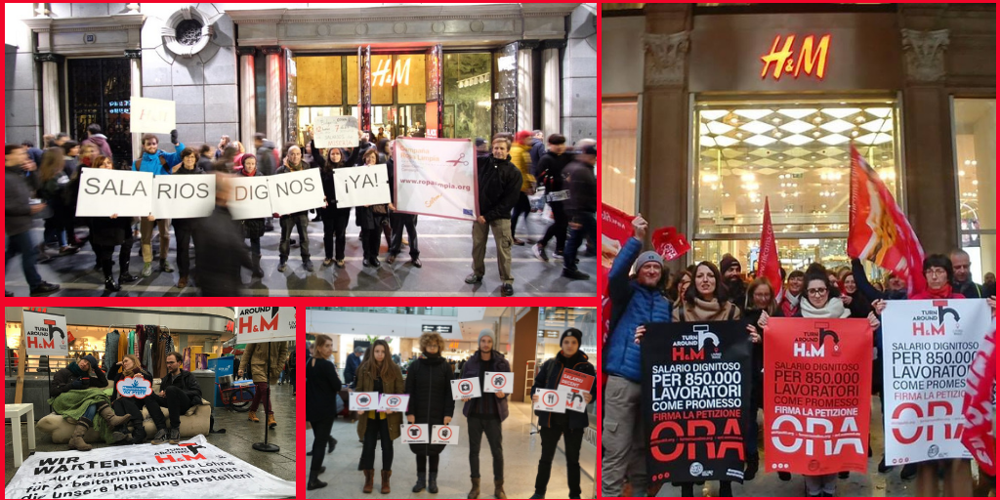
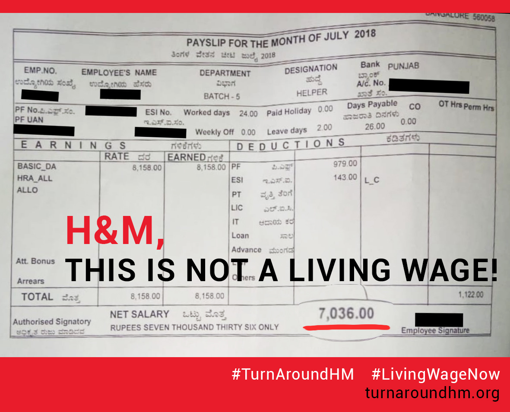

The ongoing #TurnAroundHM global week of action has shown the growing resentment over H&M’s broken living wage commitment. Workers, activists and consumers in some of H&M’s largest markets and in a number of production countries are holding H&M accountable for the broken commitment that 850,000 workers would start getting paid a living wage by this year.

<!-- end -->

Street actions and online campaigning in Austria, Belgium, Cambodia, Croatia, India, Indonesia, Italy, Germany, Hong Kong, the Netherlands, Romania, Spain, Sri Lanka, Switzerland, the United Kingdom, USA, and Turkey, among others, have been uncovering the naked truth: hundreds of thousands of workers sewing H&M clothes still cannot feed their families, send their children to school, see a doctor when they need one, or cover other basic needs.

Indeed, even the [analysis of H&M’s own data](https://turnaroundhm.org/wage-analysis-nov-2018/) shared at [the start of the global week of action](https://turnaroundhm.org/2018-11-23/) shows that the giant retailer is nowhere near ensuring a living wage for the workers who make H&M clothes. This analysis follows the [publication of research findings from six factories](https://turnaroundhm.org/wage-research-september-2018/) covered by H&M’s living wage commitment where researchers did not find a single worker earning a living wage, with workers in Bulgaria reporting earnings of less than one-tenth of an estimated living wage.

Since the launch of the [Turn Around, H&M!](https://turnaroundhm.org/) campaign in May it has also become clear that H&M is doing everything possible to erase the specific commitment referring to 850,000 workers from the collective memory [(documented here)](https://turnaroundhm.org/dossier/).

The numerous activities taking place during the global week action and beyond are making sure that such a cover-up cannot happen, and chipping away at the façade of “conscious collections”, “corporate social responsibility” reports and various self-congratulatory statements that H&M has been issuing to cover up the deprivation that workers and their families still live in.

Some examples from the last few days:

* In Germany, street actions have already taken place in the capital and in seven other cities, with more still to come. Activists in Hannover turned up in front of an H&M store in Hannover with a couch, blankets and other props to demonstrate that they are sitting around and waiting for H&M to fulfil the broken living wage promise. In Dresden, they attracted a lot of attention with something akin to a street theater piece.
* In the United Kingdom, many shoppers in London and Bristol found special tags in H&M clothing that exposed the truth about the large gap between workers’ current wages and a living wage. In Italy, actions have included a flash mob turning up in front of an H&M store in Milan during prime shopping time, with highly visible appeals for passers-by to sign the #TurnAroundHM petition, and in Romania, activists informed consumers passing through a busy shopping mall about what an actual living wage would entail.  
* In India, students and other activists displayed the truth about H&M’s broken commitment with placards at the stores in Bangalore and Delhi, whereas the action in Sri Lanka brought together about 100 women workers.
* Workers from Sri Lanka, India, Indonesia, have also started sharing their payslips which show that their current earnings are nowhere near a living wage and are certain to reach a wide online audience.

The #TurnAroundHM global week of action coincides with retailers’ prime profit-making period and with the fifth anniversary of H&M’s now broken living wage commitment. It also overlaps with the “16 Days of Activism Against Gender Based Violence” campaign.

It is notable that the vast majority of the workers that H&M is failing with the broken living wage promise are women, and they face dire consequences. As [research](https://turnaroundhm.org/2018-06-04/) published earlier this year pointed out, the continued failure by H&M to ensure a living wage exposes women garment workers to risks of violence in numerous ways.

Whereas the [#TurnAroundHM](https://turnaroundhm.org/) campaign focuses on garment factories and H&M’s specific living wage commitment, workers in other parts of H&M’s vast supply chain have also been speaking up about their working conditions and expressing solidarity.

One embodiment of this growing solidarity are the [demands toward H&M](https://turnaroundhm.org/demands/) that have been formulated in cooperation with workers and unions in different parts of the supply chain. Another example is the [open letter](https://turnaroundhm.org/letter-italy-logistics/) written by a worker in logistics, and yet another the meeting between Clean Clothes Campaign Italy and retail workers’ representatives that took place in Milan as the global week of action kicked off on Friday.

At the consumers’ end, [over 140,000 people have signed the petition](https://act.wemove.eu/campaigns/Living-Wages-HM) that is a clear call for H&M to deliver actual living wages without delay, and many are using their voice on social media, using #TurnAroundHM.

The global week of action will continue until Friday, 30 November.