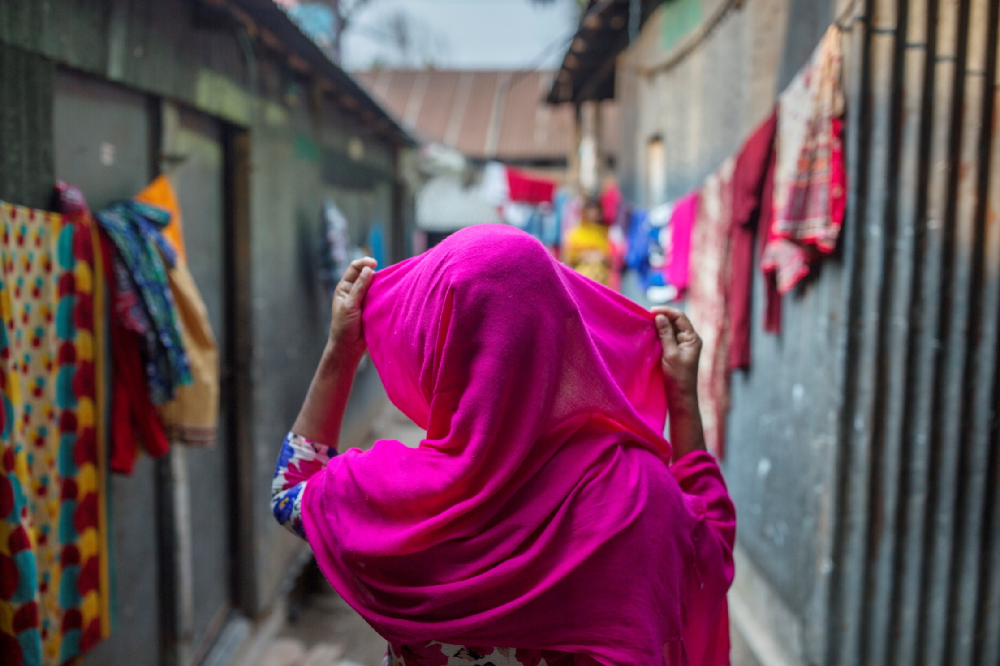

H&M did not keep the promise to make it possible for 850 000 garment workers to earn a living wage by 2018. Several Nordic banks are among H&M’s largest owners, with shares worth of over € 1,4 billion. However, the banks have not used their influence to hold H&M accountable for its living wage commitment, a new report by Fair Action and Fair Finance Guide shows.

<!-- end -->

*Photo: Jonas Gratzer*

Out of the 14 banks included in the study, only Swedbank, SEB, Storebrand, DNB and Skandia report having had some dialogue with H&M concerning living wages.* However, none of the five banks have demanded that the company share the cost of raising the wages with the suppliers.

> Factory owners in Bangladesh report that H&M’s buyers negotiate agressively to lower the prices, says Maria Sjödin, author of the report at Fair Action. This makes it diffiuclt to raise the wages.

In addition, none of the banks have followed up on the supplier wage data that H&M has presented on an annual basis. If the banks would have done so, they would have noticed that the average wage in H&M’s supply chain are still far from a living wage in Bangladesh and several other countries. 

> I run out of money about a week before I get paid, and then I have to borrow money from the neighbours to buy food, says Faria Mustafi**, 36, who works for a factory producing for H&M in Bangladesh.

Despite working up to 13 hours six days a week, Faria can only afford renting an iron shack without bathroom for her and her 15 year old daughter. The family share a kitchen with over 20 other tenants.
The report outlines the investments of Danske Bank, DNB, Handelsbanken, KLP, Länsförsäkringar, Nordea, SEB, Skandia, Storebrand and Swedbank as well as four savings banks (Sparebank 1 Nord-Norge/ SMN/SR/Östlandet) in the Nordic brands H&M, KappAhl, Lindex and MQ. 

The four fashion companies all buy clothes from Bangladesh, where employees in the factories are among the lowest paid in the world. H&M is the world’s largest buyer of garments from Bangladesh. Around 80 percent of the work force in the garment sector is female. 

The report shows that none of the banks are doing enough to push for living wages in the four companies’ supply chains. More specifically, the banks have not demanded that the garment companies set concrete objectives in terms of measurable wage increases. 

> H&M and the other Nordic fashion brands contribute to employment opportunities in one of Asia’s poorest countries, says Jakob König at Fair Finance Guide Sweden. At the same time, they should not take advantage of the women who are desperate for a job. If the banks push fashion brands to raise wages, they can contribute to lifting thousands of women and their children out of poverty.

Downlowad [the full report](https://fairaction.se/wp-content/uploads/2019/01/FairAction-bankrapport_20190131-1.pdf)

The report is a collaboration between Fair Action, Fair Finance Guide and Future in Our Hands.

\* Danske Bank and Nordea did not respond to questions about their engagement dialogue.

\*\* The workers’ real names have been withheld for security reasons.

[**Fair Action**](https://fairaction.se/english/) is a non-profit organization pushing Swedish companies to take responsibility for their impact on people and the environment. They examine how consumer goods and services are produced and pressure companies to improve working conditions and pay living wages.

[**Framtiden i våre hender (Future in our hands)**](https://www.framtiden.no/english/) is Norway’s largest environmental organization and works for a fair distribution of the world’s resources. The organization work to make government and business facilitate green and ethical choices. Framtiden i våre hender are committed to the global environment and a globally fair distribution of wealth. 

[**Fair Finance Guide**](https://fairfinanceguide.org/) is an international civil society network that evaluates banks’ considerations to social, environmental and human rights standards. Behind the initiative stand 30+ civil society organizations in nine countries. In Sweden it is led by the Swedish Consumers’ Association in partnership with the Swedish Society for Nature Conservation, Fair Action, Amnesty and Diakonia. In Norway it is a cooperation between Framtiden i våre hender and the Norwegian Consumer Council.