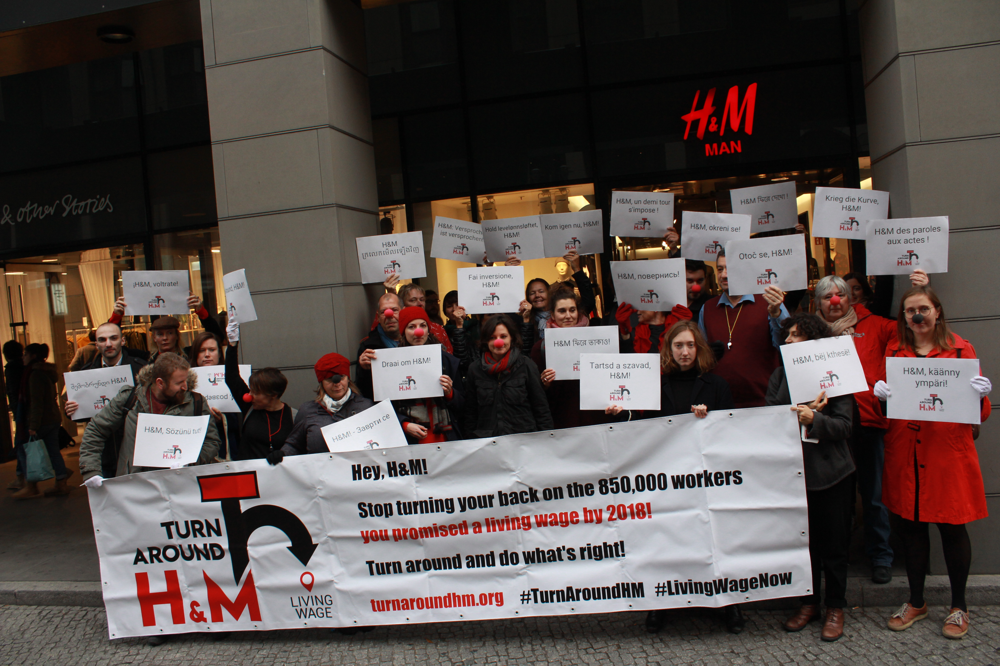

In the latest sustainability report and the accompanying public communication H&M continues to mislead the public about its progress in the area of living wage. H&M’s practice of making empty promises and bogus claims of great achievements cannot go unchallenged. Regardless of how much money and brainpower H&M pours into its corporate communication, it is an undeniable fact that workers at H&M supplier factories are still far from earning living wages.

<!-- end -->

H&M’s head of sustainability claims in an interview published on the same day as the sustainability report that H&M “have not only achieved but exceeded in all our goals” set within the five-year Fair Living Wage Strategy. The 2018 sustainability report itself attempts to create the same impression in a number of visually appealing ways. Just as the interview – quite fittingly filed under “Our stories” on H&M’s website – the fairy tale presented in the sustainability report attempts to hide the ugly truth:

**In its “Roadmap towards a fair living wage” H&M promised 850,000 workers a living wage by 2018. H&M happily took the credit for that commitment in 2013, but today not a single worker is actually making a living wage.**

There is a lot of evidence to support this claim: from our own [field research](../assets/images/hm-wages-september2018-full.pdf) to [wage data](../assets/images/wage-analysis-short-nov-2018.pdf) that H&M has been publishing, and not the least a [widely accessible statement](https://www.reuters.com/article/us-cambodia-garment-h-m/stitched-up-fashion-workers-urge-hm-to-deliver-living-wage-idUSKBN1OH1CV) by H&M’s global head of production that the number of factory workers receiving a living wage remained at “zero”.

In other words, contrary to what H&M presents in the sustainability report and elsewhere, H&M did not follow through on its promises. Instead, H&M has put a lot of effort in trying to cover up their original commitments.

### Changing the story

As we have been pointing out throughout our #TurnAroundHM campaign H&M has removed the [original roadmap documents](../assets/images/background-hm-roadmap.pdf) from its website and is instead only making available an edited version. This version omits several specific targets and commitments, namely:

- to “secure that we pay a price which enables our suppliers to pay their textile workers a fair living wage and reduce overtime”;
- that 850,000 workers would be paid a living wage through improved pay structures by 2018;
- to engage in a process with production countries’ governments to identify a living wage level, set a legal minimum wage accordingly and review wages thereafter;
- the vision that all workers employed by its commercial goods suppliers should earn a living wage.

There are many more examples of how H&M has been changing its story through the years by removing some inconvenient facts and distorting others. In this way H&M has built the foundation for making the outrageous claims of having exceeded the goals, while workers and their families continue to live in poverty.

> Indeed, multiple indicators that H&M has presented as relevant for the pursuit of a living wage have little or nothing to do with what was described in the original roadmap and with actual wage improvements for workers.

### Inappropriate measures of success

In its 2013 sustainability report H&M introduced the Fair Wage Method as an important part of their living wage work. H&M then took until May 2018 – the year when this “conscious action” was supposed to be implemented – to clarify what they mean by the FWM and how it is supposed to be implemented. Yet, despite the lack of a clear description of the FWM, H&M reported some results already for 2014, and continued to make claims of progress. In the 2018 Sustainability report, H&M claims to have exceeded its target because 500 factories (representing 67% of its product volume) are implementing improved Wage Management Systems, which have taken the FWM’s place as one of the Key Performance Indicators (p. 62).

Celebrating this as a success while workers are still paid poverty wages is not fitting of a company that wants to position itself as the industry’s leader and capitalize on the perception of being “sustainable”.

Another Key Performance Indicator according to H&M is the mechanism of “democratically-elected worker representation”, which may sound appealing but is, in fact, highly problematic.

In Bangladesh, for example, where H&M is the largest buyer, these worker committees are not allowed to negotiate on wages. In that light, presenting this as an achievement in relation to H&M’s living wage commitments is clearly misplaced to begin with.

Moreover, there are serious downsides to this form of worker representation in comparison with effective formal union representation, yet the narrative part of the sustainability report refers to the two as if they were interchangeable. An exception is a brief remark that, “Unions are particularly well suited to negotiate wages ...” (p. 66), but H&M’s list of Key Performance Indicators say nothing about whether there is genuine freedom of association and a trade union representation at supplier factories.

Among other things, H&M fails to acknowledge that worker committees often include factory management, or are influenced by the management in other ways. For instance, the relevant section of the labour law in Bangladesh was recently improved, but it is still severely criticized by International Labor Organization and international trade unions because of the role employers are allowed to play in the election process. Furthermore, there is public evidence, for example [from Human Rights Watch](https://www.hrw.org/news/2017/02/15/bangladesh-stop-persecuting-unions-garment-workers), that worker participation committees in Bangladesh have been used to thwart unions.

It has been well known, beyond Bangladesh, that worker committees can be used to undermine formal organizing, and that allowing workers to freely elect their representatives, while in itself positive, is no guarantee of these committees functioning as intended. Global union federations in particular have frequently warned against such ‘parallel means’. Workers should be allowed and able to organize themselves, free of any interference of factory management.

> Some of H&M’s most prominent production countries like Bangladesh, Cambodia and Turkey display an alarming trend of increasing repression against union leaders. Instead of investing in an alternative and weaker form of worker representation H&M should make sure the repression ends and there is genuine freedom of association.

### Disregard for workers’ human rights

Regardless of how much money and brainpower H&M pours into its corporate communication, it is an undeniable fact that workers at H&M supplier factories are still far from earning living wages.

Thus, H&M has so far failed to guarantee respect for a core human right that is also included in H&M’s own base code of conduct. Furthermore, the UN Guiding Principles for Business and Human Rights state that, “The responsibility to respect human rights is a global standard of expected conduct for all business enterprises wherever they operate. It exists independently of States’ abilities and/or willingness to fulfil their own human rights obligations, and does not diminish those obligations. And it exists over and above compliance with national laws and regulations protecting human rights”.

This means that where states fail to ensure workers are being paid a living wage – a human right according to the UN – companies are not allowed to take commercial advantage of that, and must instead themselves take effective measures to ensure that human rights are respected.

Instead of doing so, H&M is trying to evade responsibility and focusing on successes that have little or nothing to do with what was described in the original roadmap and with actual wage improvements for workers.

> We are here to remind H&M and everyone else that a few nice pictures and individual stories in the sustainability report cannot make up for lack of tangible progress in the form of a living wage appearing on workers’ payslips.

### H&M called to task

We have repeatedly called on H&M to [take concrete steps](https://cleanclothes.org/news/2019/04/03/2018/06/08/2018/03/19/public-letter-h-m-must-stick-to-the-living-wage-commitment-made-in-2013) toward a living wage actually being paid to workers as well as for transparency regarding H&M’s living wage pilots, H&M’s methodology, minimum acceptable wage levels for all production countries, the pricing structure, and the effect of efforts within multistakeholder initiatives such as ACT.

In addition, H&M should regularly publish up-to-date information on wages paid at each supplier factory, instead of the untransparent aggregate data for a few countries available thus far, so that progress toward the specific wage increase targets can actually be measured.