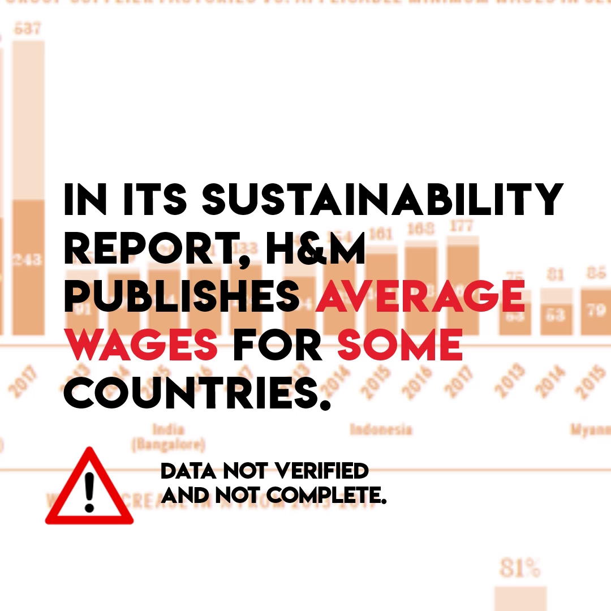

A Closer Look at H&M‘s Figures on wages at its supplier Factories.

H&M publishes information on average wages in some of its supplier factories. But what do these figures tell us about the possibility for workers who make H&M clothes to have a decent life? How close are the reported wages in H&M’s supply chain to a living wage? We took a closer look at the wages in H&M’s supply chain based on H&M’s own data.

<!-- end -->

## Key findings:

1. H&M is far away from securing workers at its supplier factories a living wage.
2. Wage increases in H&M supplier factories over the last few years are largely due to the increased legal minimum wages. What factories pay above the legal minimum has contributed far less, or has even decreased (India).
3. Because H&M does not account for inflation, real wages at H&M supplier factories have increased considerably less than one may think when first looking at H&M’s wage data.
4. In the period 2015-2017 wage progress slowed down substantially compared with the previous two years. In the case of India (Bangalore) real wages at H&M suppliers even dropped (by 4%).
5. If things continue at the 2015-2017 pace, wages at H&M supplier factories in Bangladesh and India (Bangalore) will never reach a living wage level, and in Cambodia it will take another 20 years.

Watch the short video below and look at [additional graphs and figures here]((../assets/images/wage-analysis-short-nov-2018.pdf))

`youtube: https://www.youtube.com/watch?v=cwIp5qBk0Q0`

Read the [Wage analysis here (PDF)](../assets/images/wage-analysis-short-nov-2018.pdf)

If you are interested in further details, the longer version of the wage analysis is published under the ["Delve deeper"](https://turnaroundhm.org/dossier/) section of this website.

