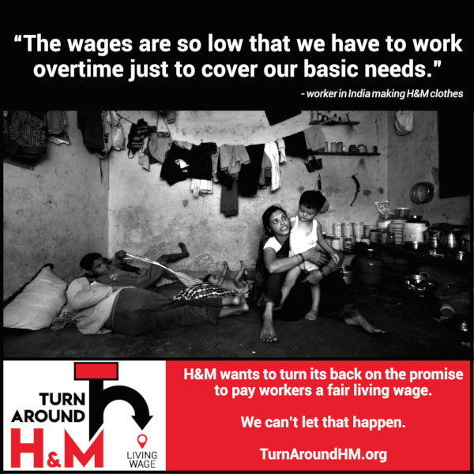
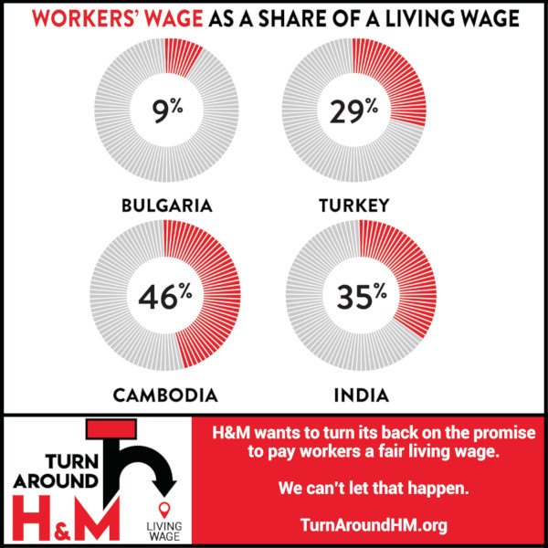

Research findings published today reveal that many workers making H&M’s clothes live below the poverty line -- despite H&M’s promise of a living wage by 2018, and despite the brand’s recent deceptive claims of progress. Interviewed workers in India and Turkey earn about a third and in Cambodia less than one-half of the estimated living wage. In Bulgaria interviewed workers’ salary at H&M’s “gold supplier” is not even 10 per cent of what would be required for workers and their families to have decent lives.
<!-- end -->

[Full research (PDF)](../assets/images/hm-wages-september2018-full.pdf) | [Summary version (PDF)](../assets/images/hm-wages-september2018-summary.pdf)
--- | ---
 | 

Research findings are published in “H&M: fair living wages were promised, poverty wages are the reality“. They include the fact that one of the world’s largest retailers, reporting USD 2.6 billion profits, has workers in the supply chain who are forced to work excessive hours for sheer survival.

### Working overtime for sheer survival

“The wages are so low that we have to work overtime just to cover our basic needs,” said a worker at an H&M “gold supplier” factory in India.
Overtime hours in three out of the six researched factories often exceed the legal maximum and working on Sundays is frequent in all four countries included in the research: Bulgaria, Turkey, Cambodia and India. In Bulgaria, workers reported that they have to work overtime just to earn the statutory minimum wage.

> “You enter the factory at 8 in the morning, but you never know when you will be able to leave. Sometimes we go home at 4 AM,” said one worker making H&M clothes at Koush Moda, an H&M “gold supplier” factory in Bulgaria.

### Workplace faintings

Poor wages, excessive overtime and the additional burden of household work result in malnutrition, fatigue and workplace faintings.
Every third Indian woman and two thirds of interviewees in Cambodia – who work at factories listed as H&M’s “platinum suppliers” – had fainted at work. A worker in India reported that fellow workers had to take her to the hospital because she had hit a machine and was bleeding internally after she had fainted at work.
Workers in Bulgaria also saw workplace faintings as an everyday work occurrence. Moreover, a worker in Bulgaria said that, “A fellow worker was fired after she fainted.”

### Research background

Interviews with workers and desk research were conducted between March and June 2018 within the “Turn Around, H&M!” campaign coordinated by Clean Clothes Campaign and actively supported by the International Labor Rights Forum and WeMove.EU.
The campaign was launched in May 2018, as it became evident that H&M is not meeting its commitment that all “H&M’s strategic suppliers should have pay structures in place to pay a fair living wage by 2018. By then, this will reach around 850 000 textile workers.” In 2013 when this commitment was made, those workers made 60% of H&M’s products, sourced from ‘strategic and preferred suppliers’ which H&M grades as gold or platinum. That was the key criterion for the selection of factories for this research.

### H&M’s words cannot be trusted

“We knew that H&M had not met its commitment by the beginning of this year, but some of the concrete findings about wages and related working conditions in H&M supplier factories still came as a shock. H&M needs to take action immediately to stop the scandal of poverty wages and workers’ rights violations,” said Bettina Musiolek of Clean Clothes Campaign who coordinated this research.

“H&M released a boastful statement last week that was a clear preemptive strike after we had sent them the findings we are publishing today. Their claims of progress are based on deception about the goals they set in 2013. Essentially, they are trying to erase those 850,000 workers who were promised a living wage by 2018 from collective memory. We will not let that happen,” said Neva Nahtigal of Clean Clothes Campaign’s International Office.  

“It is now clearer than ever that H&M’s words cannot be trusted. Instead of empty public relations talk, we want to see transparent changes in the real wages of workers in H&M’s supply chain. As we have written to the company’s top ranks before, they need to publish a road map with time-bound, measurable wage level increase targets, detailing how H&M will change their purchasing practices to make sure workers get a living wage,“ said Judy Gearhart, executive director at ILRF.

### Consumers demand action

“H&M cannot keep pretending that things are on track while workers are forced to work overtime and still live in poverty. These research findings will undoubtedly mobilize thousands of concerned citizens and conscious consumers who care about respect for human rights and sustainable production and consumption,” said Virginia Lopez of WeMove.EU.

The “Turn Around, H&M!” campaign includes a [petition hosted by WeMove.EU](https://act.wemove.eu/campaigns/Living-Wages-HM) that demands living wages and fair employment conditions in the whole H&M supply chain. The petition has already drawn over 100,000 signatures.